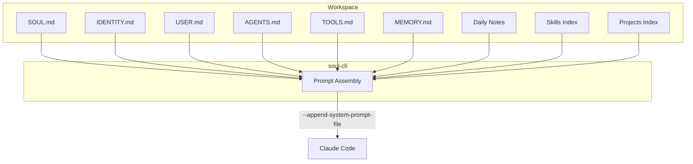
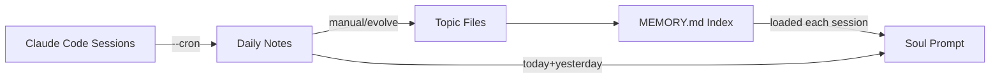

# Core Concepts

Before diving into configuration, it helps to understand the key ideas behind soul-cli.

## The Soul Prompt

Every time you run soul-cli, it:

1. Reads your soul files (`SOUL.md`, `IDENTITY.md`, `USER.md`, etc.)
2. Reads today's and yesterday's daily notes
3. Scans recent Claude Code session summaries
4. Builds a skill and project index
5. Assembles everything into one system prompt (~10-30k tokens)
6. Launches Claude Code with `--append-system-prompt-file`

Claude Code's own system prompt stays intact. Your soul is **additive** — it layers on top.



## Soul Files

Soul files are plain markdown in your workspace directory. There's no schema — write whatever you want your AI to internalize.

| File | Purpose | Required? |
|------|---------|-----------|
| `BOOT.md` | Custom startup protocol (overrides default) | No |
| `CORE.md` | Read-only rules the AI must not modify | No |
| `SOUL.md` | Personality, values, speaking style | **Yes** |
| `IDENTITY.md` | Name, role, appearance | **Yes** |
| `USER.md` | Info about you (timezone, preferences) | Recommended |
| `AGENTS.md` | Behavioral rules, safety guardrails | Recommended |
| `TOOLS.md` | Available tools, API endpoints, credentials | No |
| `MEMORY.md` | Index pointing to long-term memory topics | No |

See [Soul Files Guide](guides/soul-files.md) for detailed writing guidance.

## Memory

Memory operates at three levels:

### 1. Daily Notes (Ephemeral)

`memory/YYYY-MM-DD.md` — What happened today. Today's and yesterday's notes are loaded into every session. Older notes are not loaded (but can be searched).

The `--cron` mode auto-generates daily notes by scanning recent Claude Code session logs.

### 2. Topic Files (Durable)

`memory/topics/*.md` — Long-term knowledge organized by subject. Each file has YAML frontmatter:

```markdown
---
name: infrastructure
description: Server setup, Docker, DNS, certificates
type: reference
---

## Mac Mini (192.168.10.26)
- Runs all Docker services via Colima
- ...
```

These are referenced from `MEMORY.md` (an index file) and lazy-loaded when relevant.

### 3. Session Database (Automatic)

`sessions.db` (SQLite) — Tracks which Claude Code session files have been reviewed, their summaries, and behavioral patterns extracted from them. Managed automatically by `--cron`.



## Modes

soul-cli operates in several modes:

### Interactive (default)

```bash
myai
```

Opens Claude Code with your soul injected. The launcher **replaces itself** (`syscall.Exec`) — no proxy overhead, Claude gets your full terminal.

### One-Shot

```bash
myai -p "check disk usage"
```

Runs a single task with soul context, then exits.

### Resume

```bash
myai -r              # TUI picker for recent sessions
myai -r abc123       # Resume specific session
```

### Automated Modes

These run Claude Code as a subprocess (not interactive) and execute post-hooks after completion:

| Mode | Command | Purpose |
|------|---------|---------|
| **Cron** | `myai --cron` | Scan recent sessions, update daily notes, extract patterns |
| **Heartbeat** | `myai --heartbeat` | Health check services, process tasks, monitor patterns |
| **Evolve** | `myai --evolve` | Review interactions, improve soul files, fix bugs |

See [Automation Guide](guides/automation.md) for setup instructions.

### Server

```bash
myai server --token my-secret
```

Persistent HTTP server managing multiple Claude Code sessions, with a built-in Web UI. See [Server Mode Guide](guides/server.md).

## Binary Name = Identity

One of soul-cli's unique design decisions: **the binary name determines the AI's identity**.

```bash
go build -ldflags "-X main.defaultAppName=jarvis" -o jarvis .
```

This single flag cascades everywhere:

| Derived from name | Example (`jarvis`) |
|-------------------|--------------------|
| Home directory | `~/.jarvis/` (or `JARVIS_HOME`) |
| Data directory | `~/.jarvis/data/` |
| Session database | `~/.jarvis/data/sessions.db` |
| Lock file | `/tmp/jarvis.lock` |
| Env var prefix | `JARVIS_HOME`, `JARVIS_TG_CHAT_ID` |
| Log prefix | `[jarvis]` |

This means you can run **multiple independent agents** from the same codebase. See [Multi-Agent Guide](guides/multi-agent.md).

## Token Budget

The assembled prompt has a soft budget of **100k tokens** (Claude's context window). soul-cli estimates token usage per section (~2.5 chars/token heuristic) and warns if you exceed the budget.

Run `myai prompt` to see the assembled prompt with per-section token stats:

```
Section                 Tokens (est.)
─────────────────────────────────────
Boot protocol                    450
SOUL.md                        1,200
IDENTITY.md                      150
USER.md                          400
AGENTS.md                        800
TOOLS.md                       2,100
MEMORY.md                        600
Daily notes (today)            3,500
Daily notes (yesterday)        2,800
Session summaries              4,200
Skill index                      350
Project index                    500
─────────────────────────────────────
Total                         17,050
```

## Hooks

After automated modes (cron, heartbeat, evolve), soul-cli runs post-hooks:

1. **Built-in hooks** — Import session summaries into DB, deliver Telegram reports, run safety checks
2. **User hooks** — Shell scripts in `hooks/{cron,heartbeat,evolve}.d/` for your custom logic

Safety checks automatically detect:
- Leaked secrets in git diff
- Soul file shrinkage (>20% size reduction)
- Memory file bloat
- Config drift

## OpenClaw Integration

soul-cli was built for the [OpenClaw](https://github.com/nicepkg/openclaw) agent gateway, but works perfectly standalone.

With OpenClaw:
- Workspace path and agent name auto-read from `openclaw.json`
- Telegram bot token from OpenClaw credentials
- Telegram conversation context injected into prompts
- Skills from `~/.openclaw/skills/` indexed automatically

Without OpenClaw:
- Configure via `config.json` and environment variables
- Everything works the same, just manual configuration
