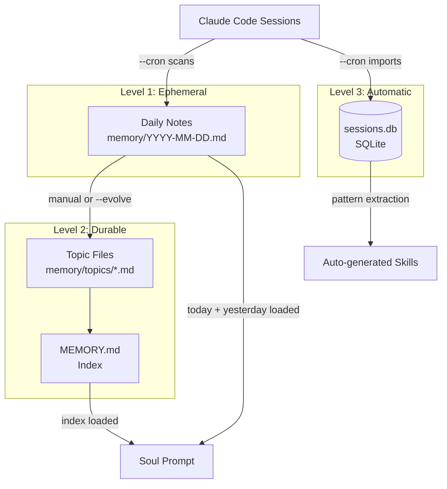

# Memory System

soul-cli gives your AI a three-level memory system that persists across sessions.

## Architecture



## Level 1: Daily Notes

**Path:** `memory/YYYY-MM-DD.md`

Daily notes record what happened each day. **Today's and yesterday's** notes are automatically loaded into every session.

### How they're created

- **Manually:** Write them yourself
- **Automatically:** Run `myai --cron` — it scans recent Claude Code session logs and generates a summary

### Format

There's no required format, but a common pattern:

```markdown
# 2025-04-07 Daily Notes

## Session: Fix auth middleware
- Refactored token validation to use middleware pattern
- Added rate limiting (100 req/min per user)
- Tests passing, deployed to staging

## Session: Debug memory leak
- Found goroutine leak in WebSocket handler
- Root cause: missing `defer conn.Close()`
- Fixed and verified with pprof
```

### Lifecycle

| Age | Behavior |
|-----|----------|
| Today | Loaded into every session |
| Yesterday | Loaded into every session |
| 2+ days | Not loaded, but searchable via `myai db search` |
| Important info | Should be promoted to topic files |

## Level 2: Topic Files

**Path:** `memory/topics/*.md`

Topic files store long-term knowledge organized by subject. They persist indefinitely and are referenced from `MEMORY.md`.

### Creating a topic file

```markdown title="memory/topics/infrastructure.md"
---
name: infrastructure
description: Server setup, Docker, networking, DNS, certificates
type: reference
---

## Production Server (10.0.1.50)
- Ubuntu 22.04, 32GB RAM, 8 cores
- Docker via containerd
- Services: nginx, postgres, redis, app

## DNS
- Domain: example.com
- Provider: Cloudflare
- Wildcard cert via Let's Encrypt
```

### Frontmatter fields

| Field | Required | Description |
|-------|----------|-------------|
| `name` | Yes | Short identifier |
| `description` | Yes | One-line summary (used for relevance matching) |
| `type` | Yes | One of: `user`, `feedback`, `project`, `reference` |

### Memory types

| Type | Purpose | Example |
|------|---------|---------|
| `user` | About the human | Role, preferences, expertise level |
| `feedback` | Behavioral corrections | "Don't mock the database in tests" |
| `project` | Ongoing work context | Sprint goals, deadlines, decisions |
| `reference` | Where to find things | "Bugs tracked in Linear project INGEST" |

### MEMORY.md index

`MEMORY.md` is a lightweight index — one line per topic, under 150 characters:

```markdown
# MEMORY.md

- [Infrastructure](memory/topics/infrastructure.md) — servers, Docker, DNS, certs
- [Lessons Learned](memory/topics/lessons.md) — past mistakes and how to avoid them
- [Project Alpha](memory/topics/project-alpha.md) — current sprint, deadline Apr 15
```

!!! warning "Keep it short"
    MEMORY.md is loaded into every session. Lines after 200 are truncated. Keep entries concise — the detailed content lives in the topic files.

## Level 3: Session Database

**Path:** `data/sessions.db` (SQLite)

The session database automatically tracks:

- Which Claude Code session files have been summarized
- Session summaries and metadata
- Behavioral patterns extracted from sessions
- Pattern feedback (success/failure/correction)

### Database commands

```bash
myai db stats                # Count of summarized sessions
myai db search "kubernetes"  # Search session summaries
myai db pending              # Sessions that need review
myai db gc                   # Clean up deleted sessions
myai db patterns             # List extracted patterns
myai db cultivate            # Generate skills from mature patterns
```

## The Cron Flow

The `--cron` mode automates the memory pipeline:

```bash
myai --cron
```

What it does:

1. **Scan** recent Claude Code session JSONL files
2. **Summarize** new sessions (via Claude)
3. **Update** today's daily notes with session summaries
4. **Extract** behavioral patterns from sessions
5. **Import** summaries into the SQLite database
6. **Cultivate** mature patterns into skills (when threshold met)

### Setting up cron

```crontab
# Run every 4 hours
0 */4 * * * PATH="$HOME/go/bin:$HOME/.local/bin:$PATH" myai --cron >> /tmp/myai-cron.log 2>&1
```

## Tips

!!! tip "Let the AI manage its own memory"
    The AI can (and should) create memory files during conversations. When it learns something important, it writes to `memory/topics/` and updates `MEMORY.md`. You don't have to do everything manually.

!!! tip "Feedback memories are powerful"
    When you correct the AI ("don't do X", "always do Y"), it should save a `feedback` type memory. These corrections persist across sessions, so you only need to say it once.

!!! tip "Search before you ask"
    The AI should search its own memory before claiming it doesn't know something:
    ```
    1. Grep memory/topics/
    2. Search session database
    3. Only then say "I don't know"
    ```
