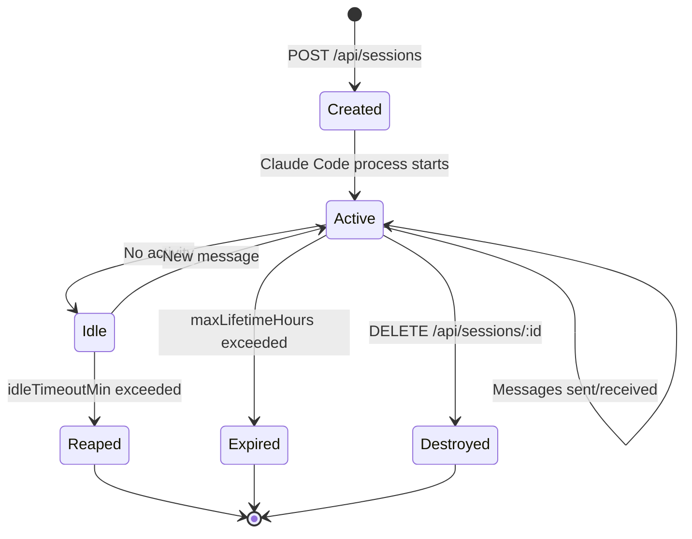

# Server Mode & Web UI

soul-cli includes a built-in HTTP server that manages persistent Claude Code sessions with a browser-based UI.

## Starting the Server

```bash
# Token is required for authentication
myai server --token my-secret

# Custom host and port
myai server --host 0.0.0.0 --port 9847

# Or use environment variable
export MYAI_SERVER_TOKEN=my-secret
myai server
```

Open `http://localhost:9847/?token=my-secret` in your browser.

## Web UI Features

The built-in Web UI (embedded in the binary, no external dependencies) provides:

- **Session sidebar** — Create, switch, and manage multiple sessions
- **Real-time streaming** — Messages stream in via SSE as Claude works
- **History browser** — Search and resume past sessions with fuzzy matching
- **Dark theme** — Easy on the eyes, always
- **Code highlighting** — Syntax-highlighted code blocks with copy button
- **Session categories** — Filter by interactive, cron, heartbeat, evolve
- **Chrome toggle** — Enable `--chrome` flag per session (for browser automation)

## Configuration

Add to your `config.json`:

```json
{
  "server": {
    "token": "your-secret-token",
    "host": "0.0.0.0",
    "port": 9847,
    "maxSessions": 5,
    "idleTimeoutMin": 30,
    "maxLifetimeHours": 4
  }
}
```

| Field | Default | Description |
|-------|---------|-------------|
| `token` | — | **Required.** Auth token for API and Web UI |
| `host` | `127.0.0.1` | Bind address |
| `port` | `9847` | Listen port |
| `maxSessions` | `5` | Max concurrent Claude Code sessions |
| `idleTimeoutMin` | `30` | Idle sessions reaped after this many minutes |
| `maxLifetimeHours` | `4` | Hard session lifetime limit |

## API Reference

All endpoints require `Authorization: Bearer <token>` header (except `/api/health`).

### Create a session

```bash
curl -X POST http://localhost:9847/api/sessions \
  -H "Authorization: Bearer $TOKEN" \
  -H "Content-Type: application/json" \
  -d '{
    "name": "fix-auth-bug",
    "initial_message": "Look at the auth middleware and find the token validation bug",
    "soul_files": true
  }'
```

### Send a message

```bash
curl -X POST http://localhost:9847/api/sessions/$SESSION_ID/message \
  -H "Authorization: Bearer $TOKEN" \
  -H "Content-Type: application/json" \
  -d '{"message": "now write a test for the fix"}'
```

### Stream output (SSE)

```bash
curl -N "http://localhost:9847/api/sessions/$SESSION_ID/stream?token=$TOKEN"
```

### List sessions

```bash
curl http://localhost:9847/api/sessions \
  -H "Authorization: Bearer $TOKEN"
```

### Resume a historical session

```bash
curl -X POST http://localhost:9847/api/sessions/resume \
  -H "Authorization: Bearer $TOKEN" \
  -H "Content-Type: application/json" \
  -d '{"session_id": "abc123"}'
```

### Destroy a session

```bash
curl -X DELETE http://localhost:9847/api/sessions/$SESSION_ID \
  -H "Authorization: Bearer $TOKEN"
```

For the complete API reference, see [Server API Reference](../reference/api.md).

## Session Lifecycle



## Telegram Integration

The server can bridge Telegram messages to Claude Code sessions:

```json
{
  "server": {
    "telegram": {
      "enabled": true,
      "allowedChatIDs": [123456789]
    }
  }
}
```

When enabled, incoming Telegram messages create or route to sessions, and responses are sent back via Telegram.

## Running as a System Service

=== "macOS (launchd)"

    ```xml title="~/Library/LaunchAgents/com.myai.server.plist"
    <?xml version="1.0" encoding="UTF-8"?>
    <!DOCTYPE plist PUBLIC "-//Apple//DTD PLIST 1.0//EN"
      "http://www.apple.com/DTDs/PropertyList-1.0.dtd">
    <plist version="1.0">
    <dict>
      <key>Label</key>
      <string>com.myai.server</string>
      <key>ProgramArguments</key>
      <array>
        <string>/usr/local/bin/myai</string>
        <string>server</string>
      </array>
      <key>RunAtLoad</key>
      <true/>
      <key>KeepAlive</key>
      <true/>
      <key>StandardOutPath</key>
      <string>/tmp/myai-server.log</string>
      <key>StandardErrorPath</key>
      <string>/tmp/myai-server.log</string>
    </dict>
    </plist>
    ```

    ```bash
    launchctl load ~/Library/LaunchAgents/com.myai.server.plist
    ```

=== "Linux (systemd)"

    ```ini title="/etc/systemd/system/myai-server.service"
    [Unit]
    Description=soul-cli server
    After=network.target

    [Service]
    Type=simple
    User=youruser
    ExecStart=/usr/local/bin/myai server
    Restart=always
    RestartSec=5

    [Install]
    WantedBy=multi-user.target
    ```

    ```bash
    sudo systemctl enable --now myai-server
    ```

## Reverse Proxy

Put it behind nginx for TLS:

```nginx
server {
    listen 443 ssl;
    server_name ai.example.com;

    ssl_certificate /etc/letsencrypt/live/example.com/fullchain.pem;
    ssl_certificate_key /etc/letsencrypt/live/example.com/privkey.pem;

    location / {
        proxy_pass http://127.0.0.1:9847;
        proxy_http_version 1.1;
        proxy_set_header Upgrade $http_upgrade;
        proxy_set_header Connection "upgrade";
        proxy_set_header Host $host;
        proxy_read_timeout 3600s;  # long timeout for SSE
    }
}
```

!!! tip "SSE needs long timeouts"
    The SSE streaming endpoint keeps connections open. Make sure your reverse proxy doesn't close them prematurely.
