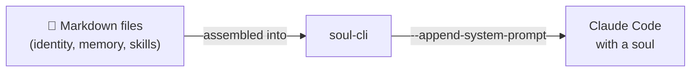

# soul-cli

**Give your Claude Code a persistent soul.**

Claude Code starts fresh every time — no memory, no personality, no idea who you are. soul-cli fixes this. Write a few markdown files, and your AI wakes up knowing its name, your preferences, and what happened yesterday.

```bash
# Tell Claude Code to do it for you:
# "Clone https://github.com/kiyor/soul-cli, build it as myai,
#  set up a workspace with soul files for me."

# Or do it yourself:
git clone https://github.com/kiyor/soul-cli.git && cd soul-cli
go build -ldflags "-X main.defaultAppName=myai" -o myai .
myai    # Claude Code, but it remembers
```

## What You Get



<div class="grid cards" markdown>

-   :material-brain:{ .lg .middle } **Memory**

    ---

    Daily notes auto-generated from session logs. Long-term topics organized by subject. Session database tracks everything. Your AI never says "as a new conversation, I don't have context" again.

-   :material-account-heart:{ .lg .middle } **Identity**

    ---

    `SOUL.md` defines personality. `USER.md` describes you. `AGENTS.md` sets guardrails. All plain markdown — no schema, no DSL.

-   :material-auto-fix:{ .lg .middle } **Evolution**

    ---

    A daily `--evolve` cron reviews recent interactions and self-adjusts. Your AI learns your feedback, refines its personality, and grows with you.

-   :material-server:{ .lg .middle } **Server Mode**

    ---

    Built-in HTTP server + Web UI. Manage multiple persistent Claude Code sessions from a browser. SSE streaming, session history, Telegram bridge.

</div>

## The Soul Prompt

soul-cli reads your workspace and assembles a system prompt (~10-30k tokens):

| Source | What it provides |
|--------|-----------------|
| `SOUL.md` | Personality, values, speaking style |
| `IDENTITY.md` | Name, role |
| `USER.md` | Your timezone, preferences, expertise |
| `AGENTS.md` | Behavioral rules, safety guardrails |
| `MEMORY.md` | Long-term knowledge index |
| `memory/YYYY-MM-DD.md` | What happened today and yesterday |
| Skills & projects | Auto-scanned from your workspace |

Claude Code's own system prompt stays intact. Your soul is **additive**.

## Three Ways to Run

=== "Interactive"

    ```bash
    myai                         # full terminal, soul injected
    myai -p "check disk usage"   # one-shot task
    myai -r                      # resume a previous session
    ```

=== "Automated"

    ```bash
    myai --cron                  # scan sessions → update daily notes
    myai --heartbeat             # health check services
    myai --evolve                # review & improve soul files
    ```

=== "Server"

    ```bash
    myai server --token secret   # HTTP API + Web UI
    # open http://localhost:9847/?token=secret
    ```

## Get Started

<div class="grid cards" markdown>

-   **[Quick Start :material-arrow-right:](getting-started.md)**

    ---

    Install, configure, launch. 5 minutes or less.

-   **[Core Concepts :material-arrow-right:](concepts.md)**

    ---

    How soul files, memory, and evolution fit together.

-   **[Soul Files :material-arrow-right:](guides/soul-files.md)**

    ---

    Deep dive into each markdown file and how to write them.

-   **[Server Mode :material-arrow-right:](guides/server.md)**

    ---

    Persistent sessions, Web UI, and API reference.

</div>
